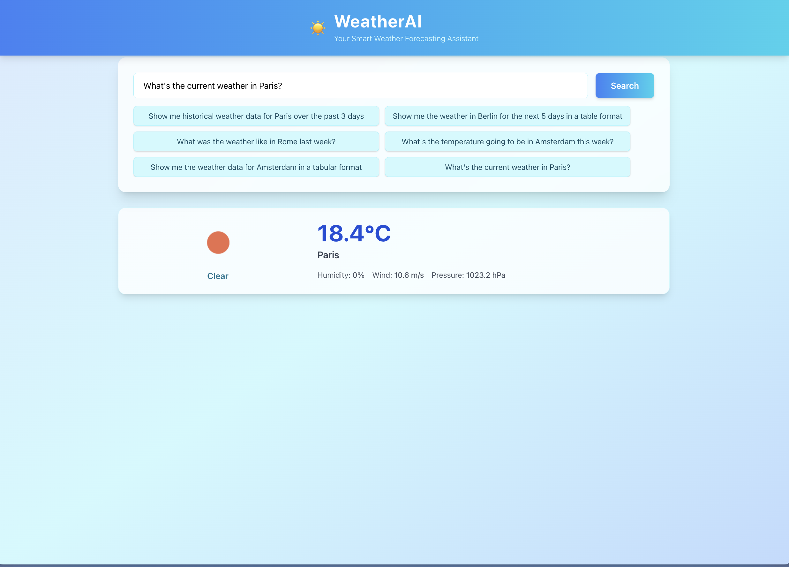
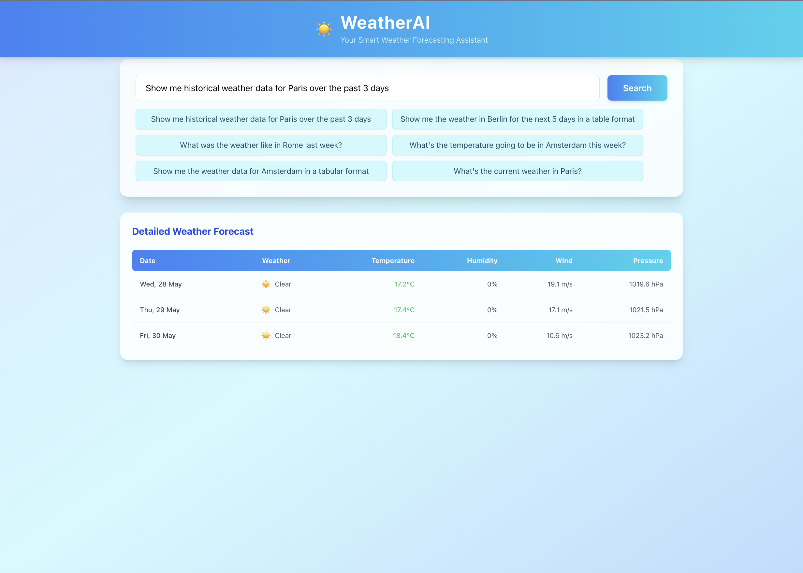
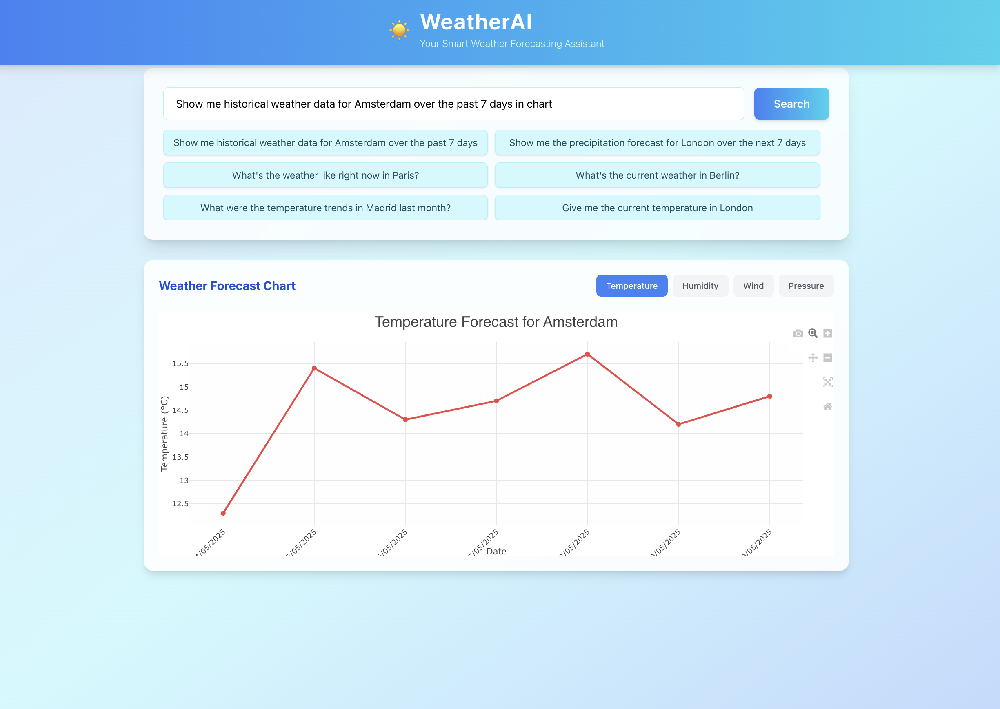

# WeatherAI - Smart Weather Forecasting Agent

An AI-powered weather agent that provides intelligent weather forecasts and responds to natural language queries about weather conditions.

## Features

- Historical weather data processing
- Weather forecasting using ML models
- Natural language query understanding
- Multiple output formats (text, tables, charts)
- Support for multiple cities
- Interactive web interface

## Screenshots

Here are some screenshots demonstrating the WeatherAI web interface in action:

### 1. Current Weather Query


*The app displays the current weather in Paris, including temperature, humidity, wind, and pressure.*

### 2. Historical Weather Data Table


*View historical weather data for Paris over the past 3 days in a detailed table format.*

### 3. Weather Data Chart


*Visualize historical weather data for Amsterdam over the past 7 days in a chart, with options to view temperature, humidity, wind, and pressure.*

## Installation

1. Clone the repository:
```bash
git clone https://github.com/yusufsevinir/WeatherAI.git
cd WeatherAI
```

2. Create a virtual environment and activate it:
```bash
python -m venv venv
source venv/bin/activate  # On Windows: venv\Scripts\activate
```

3. Install dependencies:
```bash
pip install -r requirements.txt
```

4. Create a `.env` file in the root directory and add your API keys:
```
OPENWEATHER_API_KEY=your_api_key_here
OPENROUTER_API_KEY=your_api_key_here
```

## Usage

1. Start the server:
```bash
uvicorn app.main:app --reload
```

2. Open your browser and navigate to `http://localhost:8000`

3. Use the web interface or API endpoints to interact with the weather agent

## API Endpoints

- `GET /api/weather/current` - Get current weather for a specific city
  - Query Parameters:
    - `city` (required): City name
    - `country` (optional): Country name

- `GET /api/weather/historical` - Get historical weather data
  - Query Parameters:
    - `city` (required): City name
    - `country` (optional): Country name
    - `start_date` (optional): Start date (YYYY-MM-DD)
    - `end_date` (optional): End date (YYYY-MM-DD)

- `POST /api/weather/analyze` - Analyze weather data based on natural language query
  - Request Body:
    ```json
    {
      "query": "string",
      "city": "string (optional)",
      "format": "string (optional)",
      "days": "integer (optional)"
    }
    ```

- `GET /api/sample-queries` - Get dynamically generated sample queries

## Example Queries

- "What's the current weather in London?"
- "Show me the weather in Tokyo for the past 7 days"
- "What's the temperature going to be in Paris this week?"
- "Show me the precipitation forecast for New York as a chart"

## Project Structure

```
WeatherAI/
├── backend/
│   ├── app/
│   │   ├── api/
│   │   │   └── routes.py
│   │   ├── core/
│   │   │   └── config.py
│   │   ├── models/
│   │   │   └── weather.py
│   │   ├── services/
│   │   │   └── weather_service.py
│   │   ├── utils/
│   │   │   ├── data_loader.py
│   │   │   ├── nlp_parser.py
│   │   │   └── open_weather_api.py
│   │   └── main.py
│   ├── data/
│   │   └── weather/
│   ├── scripts/
│   └── requirements.txt
├── frontend/
│   ├── src/
│   ├── public/
│   └── package.json
└── README.md
```

## Contributing

Contributions are welcome! Please feel free to submit a Pull Request.

## License

This project is licensed under the MIT License - see the LICENSE file for details. 